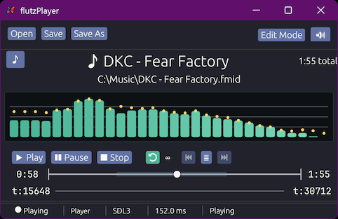
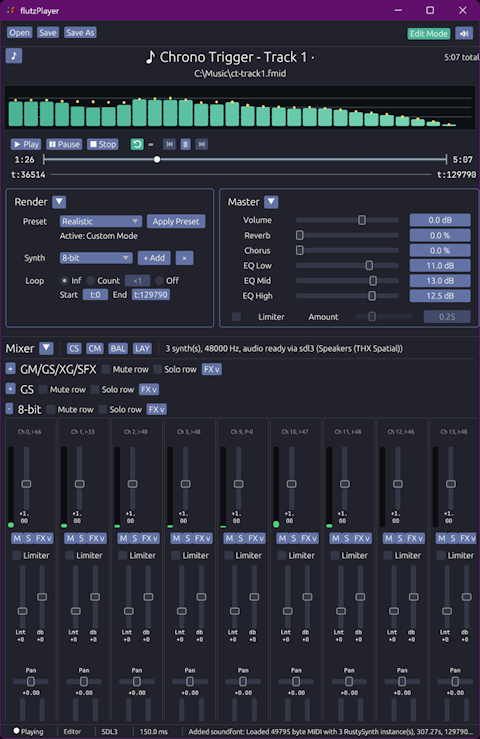
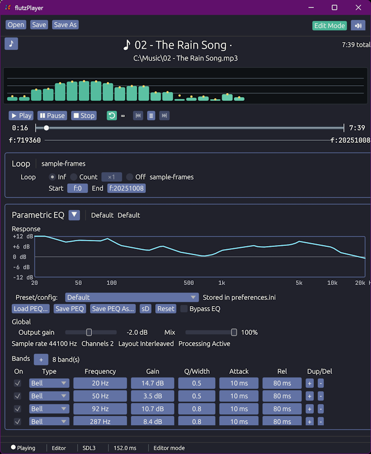

# flutzPlayer



flutzPlayer is a desktop music player and mastering tool for audiophiles who want more features and better fidelity from their audio formats. flutzPlayer accomplishes this by adding a complex mixer and mastering stage to the rendering pipeline which users can tune to their specific needs. These mastered versions can be saved in a flutz wrapper format so that settings persist across playback.

For example, MIDI files can be mastered and saved as FMidi files, combining:
- Per-track, configurable layered SoundFonts (multiple, simultaneous fonts, blended, your way)
- Fine-grain control of loop points and styles
- Master Mixer control for gain, effects and EQ
- Per-font, Per-instrument control of gain, effects, panning and EQ
- The original source file unmodified and intact



This allows enriched playback of MIDI files to produce the best sound to match the composer intent; 8-bit tracks sound like 8-bit hardware, symphonic tracks sound non-synthetic, and composers can ensure you hear their tracks on the retro hardware they designed it for - all without having to change rendering settings between tracks.



Encoded Audio format support! Remaster your audio files by saving in a flutz format, enabling track-level Parametric EQ/Mastering or simply set default equalizer settings to best fit your speakers or preferences.

**Quick Notes:**
 - This should compile and work on all OS, but has only been tested in Windows
 - Memory and CPU loads have only basic Optimization; Runs very well for me using only 67MB of memory (YMMV)
 - UI is intentionally simple, CTRL+/CTRL- are your friend
 - Project needs a better UI
 - this project's main goal is to exercise the sound engine of the flutzBox emulator 
 - this build-init script will configure build artifacts so builds work and assumes MSYS/GNU Toolchain
 - i'm not an audio engineer

## Download, Install, and Use

1. Download the latest flutzPlayer release package
2. Extract it anywhere (portable layout)
3. Run flutzplayer.exe


## Music Format Support Matrix

| Format family | Extensions | Current status | Notes |
| --- | --- | --- | --- |
| Standard MIDI | .mid, .midi | Supported | Primary source input format. |
| flutz MIDI wrapper | .fmid | Supported | Embedded MIDI + persisted mix/render/project data. |
| flutz playlist | .fplist | Supported | Playlist/session container (not an audio codec). |
| MP3 | .fmp3 | Supported | |
| FLAC | .fflac | Supported | |
| Ogg Vorbis / Opus | .fogg / .fopus | Supported | |
| WAV / AIFF | .fwav / .faiff | Supported | |
| AAC in MP4/M4A | .fm4a / .fmp4 | Supported | |

## Developer Build Guide

### Windows MSYS prerequisites

The Windows build uses a POSIX shell and GNU userland tools for the vendored `tikv-jemalloc-sys` configure/make step. Install MSYS2 and the MinGW64 toolchain before running `build-init.ps1`.

Recommended MSYS2 packages:

```powershell
pacman -S --needed base-devel mingw-w64-x86_64-toolchain
```

That gives you the tools this build expects, including `sh`, `bash`, `sed`, `grep`, `expr`, `gawk`, `make`, `ar`, `nm`, and `install`.

Make sure one of these shell locations is available so the bootstrap script can discover it automatically:

- `C:\msys64\usr\bin\sh.exe`
- `C:\Program Files\Git\bin\sh.exe`
- `C:\Program Files\Git\usr\bin\sh.exe`

If MSYS2 is installed somewhere else, set `MSYS2_ROOT` to the MSYS2 install root before running the bootstrap script. The build also uses the same shell path for `CONFIG_SHELL`, `SHELL`, and `MAKESHELL` during jemalloc configuration.

## Design Philosophy

- Code and data structures must be future-proof
- Don't interrupt the user
- Errors should not create stoppages
- No application or format version numbering

## Clone and bootstrap

If you are setting up the Windows development environment for the first time, install the MSYS2 packages above first, then continue here.

```powershell
git clone https://github.com/cmykflutterby/flutzPlayer.git
cd flutzPlayer
.\build-init.ps1
```

This prepares the local dev layout, vendors the required external crate sources, and stages the workspace so the regular build scripts can run without manual setup.

To return the checkout to a pre-initialized state, run:

```powershell
.\build-init.ps1 -Clean
```

## First build/validation flow

```powershell
cargo check -p flutzplayer
.\build.ps1 -Configuration Debug -BuildDat
```

Run from source:

```powershell
cargo run -p flutzplayer -- --gui --data-dir drops/flutzplayer/data
```

Run packaged drop:

```powershell
.\drops\flutzplayer\flutzplayer-debug.exe --gui --data-dir .\drops\flutzplayer\data
```
Build DAT fileset:

```powershell
.\build-dat.ps1
```

Create build:

```powershell
.\build.ps1 -Configuration Release
```

Create build with fresh DATs:

```powershell
.\build.ps1 -Configuration Release -BuildDat
```

**NOTES:**

- [build.ps1](build.ps1): workspace build + drop staging
- [build-dat.ps1](build-dat.ps1): DAT generation from [assets/dat-manifest.toml](assets/dat-manifest.toml)

## Bundled SoundFonts 

These sound fonts combine to create a 'standard', initial set of fonts used by the player. The sets and individual fonts can be expanded and customized by altering the manifests and rebuilding the DAT fileset to include the soundfonts of your choice. These particular fonts have been selected because of their unique construction, quality, or rendering intent and represents a decent cross-section of well-known sound fonts in the community.

Soundfonts are configured and named in: [assets/dat-manifest.toml](assets/dat-manifest.toml).

| Font | File | Attribution | License | Note |
| --- | --- | --- | --- | --- |
| 8-bit | 8bitsf.SF2 | [8bitsf package author(s)](https://musical-artifacts.com/artifacts/23) | [CC-4.0](https://creativecommons.org/licenses/by/4.0/deed.en) | |
| Retro | Arachno_SoundFont_Version_1.0.sf2 | [Arachno SoundFont](https://www.arachnosoft.com/main/soundfont.php?documentation=fullscreen#copyright) | Free Non-commercial | Amazing work |
| General Midi | FluidR3_GM2-2.SF2 | [FluidR3](https://member.keymusician.com/Member/FluidR3_GM/index.html) | Public Domain | Commonly Used |
| Roland | Roland_SC-55_v2.2_by_Patch93_and_xan1242.sf2 | [Patch93 and xan1242](https://github.com/nitro-shoe/sc-55-soundfont) | [CC-4.0](https://creativecommons.org/licenses/by/4.0/deed.en) | |
| OPL3 | OPL-3 FM 128M.sf2 | [OPL3 package author(s)](https://musical-artifacts.com/artifacts/15) | [CC-4.0](https://creativecommons.org/licenses/by/4.0/deed.en) | Adlib |
| AWE-64 | Sound.Blaster.Restoration.Project.sf2 | [Sound Blaster Restoration Project](https://github.com/nitro-shoe/sound-blaster-restoration-project) | [CC-4.0](https://creativecommons.org/licenses/by/4.0/deed.en) | The Originator |
| GS | SONiVOX_GS250.sf2 | [SONiVOX GS250](https://www.sonivoxmi.com/) | | Full GS |
| SNES | Super_Nintendo_Unofficial_update.sf2 | [Super Nintendo unofficial update](https://musical-artifacts.com/artifacts/560/) | |  |
| MegaDrive | The_Ultimate Megadrive_Soundfont[v1.5].sf2 | [Ultimate Megadrive](https://musical-artifacts.com/artifacts/24) |  |  |
| Wii | The_Ultimate_Wii_Soundfont_V1-1.sf2 | [Ultimate Wii](https://musical-artifacts.com/artifacts/542) | | |
| GM/GS/XG/SFX | Timbres Of Heaven GM_GS_XG_SFX V 3.4 Final.sf2 | [Timbres Of Heaven](https://midkar.com/SoundFonts/index.html) | | Full Coverage |
| Simple GM | TimGM6mb.sf2 | [TimGM ](https://github.com/arbruijn/TimGM6mb) |  | |
| XG | Yamaha_XG_Sound_Set.sf2 | [Yamaha XG](https://musical-artifacts.com/artifacts/2569) |  | Accurate Samples |
| HiDef | HiDef2.sf2 | [HiDef (4GiB Roland SC-88Pro)](https://musical-artifacts.com/artifacts/2525) | [CC-3.0 Unported](http://creativecommons.org/licenses/by-3/4.0/deed.en) | Maybe the best SF i've heard. Not included, rebuild your DAT with this!  |

*NOTE: This table is not kept up-to-date, please visit these sources for up-to-date information.

## DAT File packing

DAT files are loaded together to allow an easy and quick method for granular loading of mixed file types. flutzPlayer uses this archive format to store and retrieve soundfont data. This format is a simple concatenation of files, prepended with a detailed index and then chunked into multiple files. DAT filesets can be tuned so that smaller chunk sizes are created and different types of files can be stored and intermixed. The resulting format allows for easy implementation of multi-threaded, simulateous loading of different data, application awareness of data storage layout, easier distribution of files and tunable filesets that match target IO performance where needed. The granular and quick loading is facilitated by a detailed soundfont analysis, map and manifest that is generated and stored alongside each embedded soundfont, allowing the player to directly load individual instruments from specific soundfonts on the fly.

## Crates

| Crate | Purpose | Notes |
| --- | --- | --- |
| flutz_app | Desktop app composition/UI | Main app shell, release/debug UI, metadata editor, and playback orchestration |
| flutz_audio_sdl3 | SDL3 audio backend wrapper | Default audio output; no flag needed |
| flutz_audio_wasapi | WASAPI backend wrapper | Windows output path with ring-buffered playback; enable with the WASAPI flag |
| flutz_core | Shared domain/core types | Common error, preset, and workspace-wide data types |
| flutz_dat | DAT archive read/write and pack logic | Multi-threaded instrument loading and DAT packaging |
| flutz_fmid | FMID format implementation | MIDI wrapper/project container persistence |
| flutz_formats | Common playable format registry and wrapper records | Symphonia-backed decode, metadata, and wrapper handling |
| flutz_format_aac | AAC/MP4 backend registration | Symphonia decode probe support for AAC/MP4 |
| flutz_format_flac | FLAC backend registration | Symphonia decode probe support for FLAC |
| flutz_format_mp3 | MP3 backend registration | Symphonia decode probe support for MP3 |
| flutz_format_ogg | Ogg Vorbis/Opus backend registration | Symphonia decode probe support for Ogg Vorbis and Opus |
| flutz_format_pcm | WAV/AIFF PCM backend registration | Symphonia decode probe support for PCM containers |
| flutz_mixer | Mixer DSP/control primitives | Shared mixer, EQ, limiter, and routing primitives |
| flutz_peq | Streaming parametric EQ primitives | Decoded-audio mastering presets and runtime PEQ |
| flutz_soundfont_tools | SoundFont tooling/conversion utilities | sf2/sf2Ark conversions, analysis, and SoundFont pipeline helpers |
| flutz_synth | MIDI/synth runtime orchestration | Playback runtime, note scheduling, and routing |
| flutz_visualizer_core | Visualizer DSP core | Configurable spectrum and analyzer frame generation |
| flutz_visualizer_egui | egui visualizer adapter | egui renderer for visualizer frames |
| rustystem | RustySynth-derived renderer fork | Granular stem-level rendering and synth backend support |

## Inspirations

flutzPlayer builds inspiration from:
- flutzBox fantasy console (audio engine lifted from emulator)
  - under heavy development, no URL
- RustySynth (rendering lineage and behavior baseline): https://github.com/sinshu/rustysynth
  - Please check out this project and it's related projects. Solid work and a good baseline for anyone wanting to learn about synthesizers, MIDI and sf tech in a rust-context
- CoolSoft VirtualMIDISynth (workflow inspiration for practical SoundFont-backed MIDI playback): https://coolsoft.altervista.org/en/virtualmidisynth
  - Great utility for using soundfonts on windows machines; allows any app passing midi to the OS to use a configurable layered soundfont rendering (perfect for your DOSBox gaming!)
